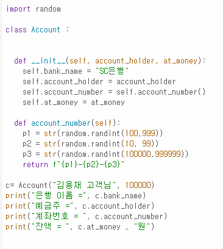
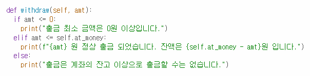

# AIFFEL Data Scientist Campus Code Peer Review Templete

코더 : [윤태경]

리뷰어 : [안동균]

---

🔑 **PRT(Peer Review Template)**

[ ]  **1. 주어진 문제를 해결하는 완성된 코드가 제출되었나요?**
Q1. 완료 / 생성자에 예금주, 초기 잔액 외 다른 부분이 들어가있음

Q2. 완료

Q3. get_account_num() 메소드가 아니라 변수로 지정함

Q4. 완료

Q5. 완료

Q6. 완료

Q7. 완료

Q8. 완료

Q9. 완료

Q10. 완료

    
[v]  **2. 전체 코드에서 가장 핵심적이거나 가장 복잡하고 이해하기 어려운 부분에 작성된 
	- 메소드 마다 무슨 기능을 하는지 주석을 작성하지 않아 아쉬웠음
        
[v]  **3. 에러가 난 부분을 디버깅하여 문제를 “해결한 기록"을 남겼거나 "새로운 시도 
또는 추가 실험"을 수행해봤나요?**
    - 문제기술에선 5회라고 정해져 있지만 5회마다로 변경하여 코드를 작성함
    

        
[v]  **4. 회고를 잘 작성했나요?**
    - 회고록을 작성하지 않아도 될 문제임

[v]  **5. 코드가 간결하고 효율적인가요?**
    - 문제에서 정의 한대로 메소드 내용을 성공적으로 작성함

---
### 참고 문헌
